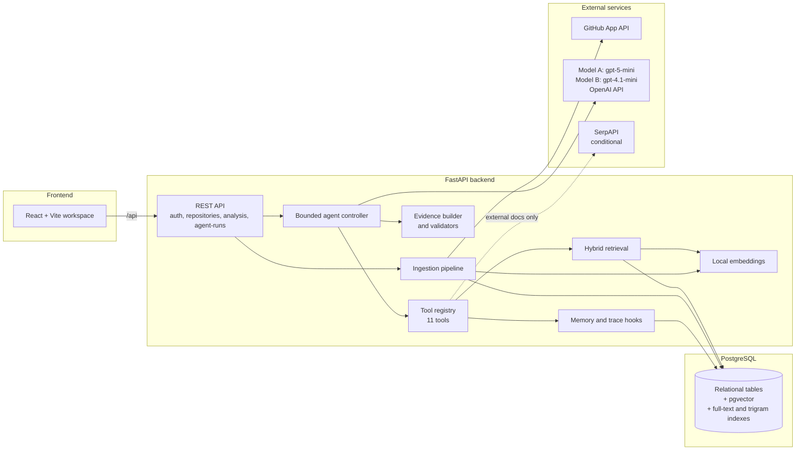
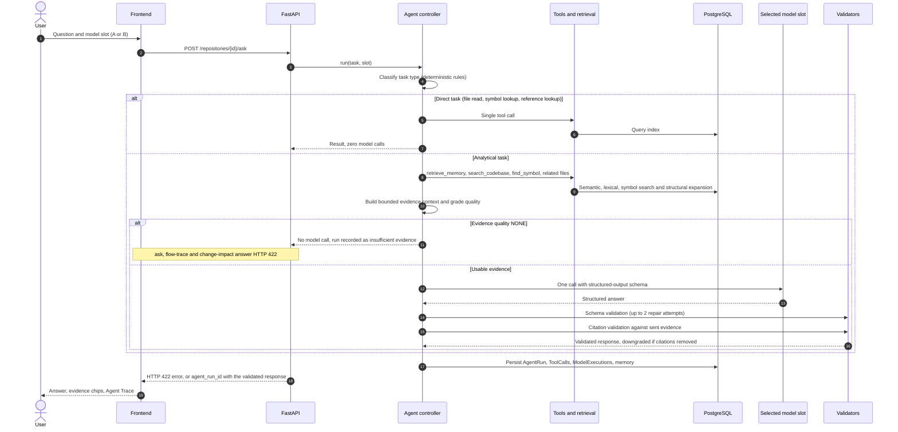
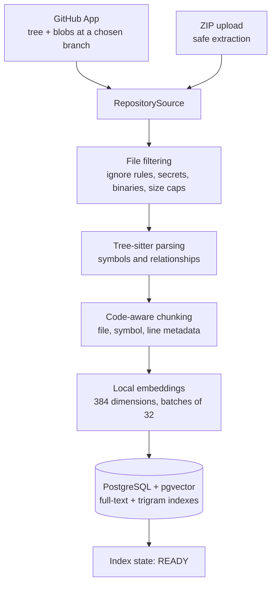
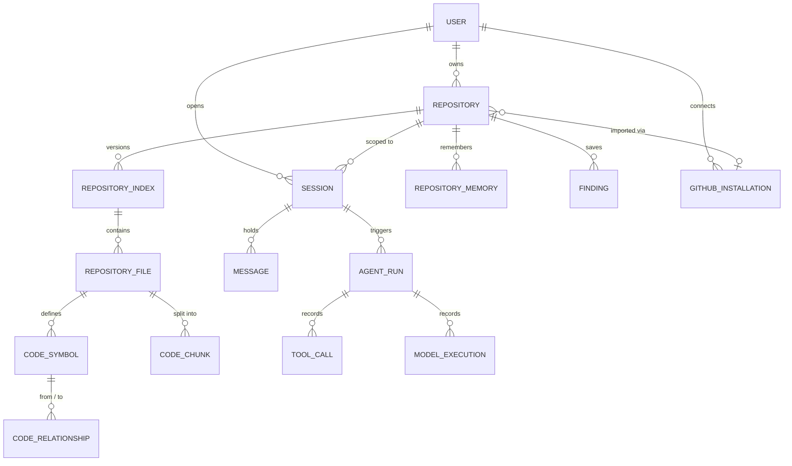

<p align="center">
  
</p>

<h1 align="center">PRISM</h1>

<p align="center">
  <strong>Agentic RAG for Codebase Intelligence</strong>
</p>

<p align="center">
  Index a repository, then ask questions, trace multi-file flows, and assess change impact -<br/>
  with every claim tied to validated file, symbol, and line evidence.
</p>

<p align="center">
  
  
  
  
  
  
  
  
</p>

---

## Contents

1. [Overview](#overview)
2. [Demo](#demo)
3. [Core capabilities](#core-capabilities)
4. [System architecture](#system-architecture)
5. [How PRISM works](#how-prism-works)
6. [Agentic RAG architecture](#agentic-rag-architecture)
7. [Flagship workflows](#flagship-workflows)
8. [Evidence and citation grounding](#evidence-and-citation-grounding)
9. [Ask vs Ask and Compare](#ask-vs-ask-and-compare)
10. [Technology stack](#technology-stack)
11. [Repository structure](#repository-structure)
12. [Getting started](#getting-started)
13. [GitHub integration](#github-integration)
14. [Configuration](#configuration)
15. [API overview](#api-overview)
16. [Persistence architecture](#persistence-architecture)
17. [Evaluation and quality assurance](#evaluation-and-quality-assurance)
18. [Security and privacy](#security-and-privacy)
19. [Supported scope](#supported-scope)
20. [Deployment](#deployment)
21. [Development and testing](#development-and-testing)
22. [Design principles](#design-principles)
23. [Limitations](#limitations)
24. [Non-goals and future work](#non-goals-and-future-work)
25. [License](#license)

---

## Overview

PRISM is a read-only code intelligence system. It ingests a repository (from a GitHub App installation or a ZIP upload), builds a structural and semantic index in PostgreSQL, and answers engineering questions about that repository with evidence a reader can check: real file paths, symbol names, and line ranges.

Ordinary semantic search over embedded files is not enough for codebase questions. A question such as "how does login reach the database?" spans a frontend form, an API client, a route handler, a service, a repository function, and a password check. Embedding similarity finds fragments, but it does not know which function calls which, and a language model given those fragments will happily connect them with plausible prose that the code does not support.

PRISM addresses this in three ways:

- **Structure-aware indexing.** Tree-sitter parses source into symbols and relationships (`CALLS`, `IMPORTS`, `REFERENCES`, `EXTENDS`, `API_CALL`). Chunks carry file, symbol, and line metadata.
- **Hybrid retrieval with structural expansion.** Semantic (pgvector), lexical (PostgreSQL full-text), and symbol (exact and trigram) signals are merged with fixed weights, then expanded along stored code relationships.
- **A bounded controller and a validation gate.** A single custom controller selects tools within hard limits, builds a bounded evidence context, calls exactly one model, and then validates the structured output and every citation against the evidence that was actually sent. Unsupported citations are removed and confidence is downgraded.

PRISM analyzes repositories. It does not modify them.

---

## Demo

[Click here to watch the video - Prism Demo](https://drive.google.com/file/d/16sAkYTmFAVgeJP1HIQzgZXoiIku-Tkx9/view?usp=drive_link)

---

## Core capabilities

| Capability | What it does | Where it lives |
| --- | --- | --- |
| **Codebase Q&A** | Answers natural-language questions with cited evidence, a confidence level, and stated limitations. Simple lookups (read a file, find a symbol, find references) are answered directly without a model call. | `backend/app/agent/controller.py`, `POST /repositories/{id}/ask` |
| **Multi-file Flow Trace** | Picks an entry symbol, walks stored call/import/API relationships, and returns ordered steps with file, symbol, line range, and evidence IDs. Transitions that cannot be proven from observed relationships stay marked `unresolved`. | `backend/app/agent/investigations/flow_trace.py`, `POST /repositories/{id}/flow-trace` |
| **Change Impact Analysis** | Given a described change, separates *directly affected* from *likely indirectly affected* symbols, each with reason, confidence, recommended action, and tests to inspect. | `backend/app/agent/investigations/change_impact.py`, `POST /repositories/{id}/change-impact` |
| **Architecture Explanation** | Summarizes languages, main folders, detected frameworks, entrypoints, backend/frontend boundaries, database layer, API organization, auth and test locations from the stored index; the model only narrates facts the tool returned. | `backend/app/agent/architecture.py`, `GET /repositories/{id}/architecture` |
| **Repository ingestion** | GitHub App import (with branch selection) or ZIP upload, both through one shared normalization and indexing pipeline. Incremental sync for GitHub repositories compares blob SHAs. | `backend/app/ingestion/`, `backend/app/sources/` |
| **Hybrid retrieval** | Semantic + lexical + symbol retrieval, overlap deduplication, adjacent-chunk merging, and structural expansion. | `backend/app/retrieval/` |
| **Evidence and citation validation** | Bounded evidence context; deterministic checks on evidence ID, file path, line range, repository, and index version. | `backend/app/evidence/`, `backend/app/validation/` |
| **Model slots and comparison** | Two equal, independently configured model slots: Model A is `gpt-5-mini` and Model B is `gpt-4.1-mini`, both from OpenAI through its OpenAI-compatible API. A normal request uses the selected slot only; *Ask & Compare* runs both against the same evidence and prompt. | `backend/app/llm/`, `backend/app/agent/compare.py` |
| **Conditional web search** | For questions classified as external or current documentation, a SerpAPI-backed plugin adds `WEB` evidence, cached for 24 hours. Ordinary repository questions never search the web. | `backend/app/plugins/web_search/` |
| **File reading plugin** | Bounded reads (up to 4,000 lines) of files and line ranges from the stored index, with a secret-filename denylist. | `backend/app/plugins/file_reading/` |
| **Memory and findings** | Evidence-backed repository facts, session summaries, and user-saved findings. Repository memory is marked stale when its source files change. | `backend/app/memory/` |
| **Hooks and Agent Trace** | Pre/post tool hooks persist every run, tool call, and model execution (credentials redacted). The UI renders the recorded trace. | `backend/app/tracing/`, `GET /agent-runs/{id}/trace` |
| **Workspace UI** | Repository dashboard, indexing status, file tree and code viewer, Analyze tab (Ask, Flow Trace, Change Impact, Architecture, Compare), Agent Trace, Memory, Findings, and Settings. | `frontend/src/` |

---

## System architecture

### High-level view



### Query flow



### Ingestion flow



---

## How PRISM works

### Ingestion and indexing

`backend/app/ingestion/pipeline.py` drives indexing. The index moves through the states `PENDING`, `DISCOVERING`, `PARSING`, `EMBEDDING`, `INDEXING`, and then `READY`, `PARTIAL`, or `FAILED`.

1. **Sources.** `RepositorySource` implementations for GitHub (`sources/github.py`) and ZIP upload (`sources/upload.py`) both feed the same pipeline.
2. **Filtering** (`ingestion/filtering.py`). Excludes directories such as `.git`, `node_modules`, `dist`, `build`, `venv`, and `__pycache__`, honors `.gitignore` patterns, and drops secret-like files (`.env*`, `*.pem`, `*.key`, `id_rsa*`, `*.p12`, `credentials.json`, `secrets.*`) and binary extensions. Oversized files are recorded with status `OVERSIZED`, binaries as `BINARY`, and parse errors as `PARSE_FAILED`.
3. **ZIP safety** (`ingestion/security.py`). Validates entry paths and rejects traversal, absolute and drive-qualified paths, and symlinks before any extraction. Enforces ZIP size, extracted size, and file-count limits.
4. **Parsing** (`app/parsing/`). Tree-sitter parsers for Python, JavaScript, TypeScript, JSX, and TSX extract symbols (functions, methods, classes, routes, and similar) and relationships between them. A fallback parser handles files the grammar cannot parse.
5. **Chunking** (`app/chunking/`). Structure-aligned chunks with file, symbol, and line-range metadata. For example, symbols above 4,000 characters are split with a 200-character overlap. Configuration and documentation files use a document chunker.
6. **Embeddings** (`app/embeddings/`). A local `sentence-transformers` provider (default `BAAI/bge-small-en-v1.5`, 384 dimensions, batches of 32). Embeddings are independent of Model A and Model B.
7. **Persistence.** Files, symbols, relationships, and chunks are stored per repository index. Migrations create the `vector` and `pg_trgm` extensions, an IVFFlat cosine index on chunk embeddings, a generated `tsvector` column with a GIN index for lexical search, and a trigram index on symbol names.
8. **Incremental sync** (`ingestion/sync.py`). For GitHub repositories, changed files are found by comparing stored blob SHAs. Unchanged files and chunks are copied to a new index version, changed files are re-parsed and re-embedded, deleted files are dropped, and repository memory derived from changed files is marked stale. If GitHub access is lost, the existing index stays readable and synchronization is refused.

### Query-time execution

1. **Classification** (`agent/classification.py`). Deterministic rules assign one of eight task types: `DIRECT_FILE_OP`, `SYMBOL_LOOKUP`, `REFERENCE_LOOKUP`, `REPOSITORY_QA`, `ARCHITECTURE_EXPLANATION`, `FLOW_TRACE`, `CHANGE_IMPACT`, `EXTERNAL_DOC_QUERY`. Classification does not use a model.
2. **Retrieval** (`app/retrieval/`). Described in the next section.
3. **Context construction** (`evidence/context_builder.py`). Selects at most 16 evidence items, each excerpt capped at 4,000 characters, within an approximate 8,000-token budget. Evidence is grouped so distinct files and query clauses are represented before near-duplicates.
4. **Evidence grading** (`evidence/quality.py`). Classifies context as `STRONG`, `INCOMPLETE`, `CONFLICTING`, or `NONE`.
5. **Model invocation** (`app/llm/`). One structured-output call to the user-selected slot, using versioned prompt templates in `backend/app/agent/prompts/v1/`. Repository content is placed in an explicitly untrusted evidence zone.
6. **Validation** (`app/validation/`). Schema validation (with bounded repair) followed by citation validation.
7. **Persistence and trace.** The run, its tool calls, and model executions are stored; repository memory is written when evidence supports it.

---

## Agentic RAG architecture

PRISM is not an "embed files and query vectors" pipeline. The differences are concrete and bounded:

**Deterministic routing.** The controller, not the model, decides which tools run. Model output is never interpreted as a tool directive. This is a deliberate prompt-injection boundary, exercised by a security test.

**Tool registry.** `tools/registry.py` registers eleven tools: `search_codebase`, `find_symbol`, `find_references`, `get_related_files`, `inspect_repository`, `retrieve_memory`, `save_memory`, `get_review_history`, `read_file`, `read_file_range`, and `search_web`. Every tool checks repository ownership before executing.

**Hard bounds** (constants in `agent/controller.py`):

| Bound | Value |
| --- | --- |
| Tool iterations per run | 12 |
| Structural expansion rounds | 5 |
| Structural chunks added | 24 |
| Web searches | 3 |
| Model calls per run | 1 |
| Schema repair attempts | 2 |
| Evidence items in context | 16 |

Exceeding a bound ends the run with status `BOUNDS_EXCEEDED`; other terminal statuses are `OK`, `INVALID_OUTPUT`, and `ERROR`.

**Hybrid, code-aware retrieval.** `HybridRetriever` runs three signals and merges them:

- *Semantic*: pgvector cosine distance, 30 candidates.
- *Lexical*: PostgreSQL `ts_rank_cd` over a generated search vector, 30 candidates, with camelCase and snake_case term splitting and stopword handling.
- *Symbol*: exact-name matches plus `pg_trgm` fuzzy matches (similarity above 0.3, up to 10).

Scores are normalized and combined with fixed weights (semantic 0.5, lexical 0.3, symbol presence 0.2, plus a 0.5 boost for an exact symbol match). Results are deduplicated by chunk and line overlap and adjacent chunks are merged.

**Structural expansion.** From up to 8 seed symbols, `retrieval/expansion.py` follows stored `CodeRelationship` rows in both directions and pulls in parent symbols, so the context includes callers, callees, and containing classes, not only textually similar code. Expanded evidence is flagged and ranked after directly retrieved evidence.

**Investigations.** Flow Trace and Change Impact run dedicated, cached, tool-bounded investigations (`agent/investigations/`) that build a graph from observed relationships before any model call. The model then narrates and organizes; `enforce_observed_transitions` and `enforce_observed_impacts` reject model claims that are not backed by observed graph facts and fall back to deterministic output.

**Conditional external research.** `EXTERNAL_DOC_QUERY` is routed through the same `/ask` endpoint. `search_web` results become `WEB` evidence, distinct from repository evidence in the API and UI. A missing or failing provider is reported as a limitation.

**Fallback behavior.** There is no automatic model fallback. If the selected slot fails, the failure is traced and returned. When evidence is `NONE`, the controller skips the model call and records an "Insufficient repository evidence" result. The `ask`, `flow-trace` and `change-impact` endpoints then answer with HTTP 422 and an error detail carrying the `agent_run_id`, not a generated answer. Multi-part questions that are only partly supported get a per-subquestion limitation.

---

## Flagship workflows

### Codebase Q&A

A developer asks a question in the Analyze tab and selects a model slot. The controller retrieves hybrid evidence, checks repository memory, builds a bounded context, and requests a `RepositoryAnswer` (answer, evidence, confidence, limitations). After validation, the UI shows the answer with evidence chips that open the exact file and lines in the code viewer. Lookups phrased as "find `X`", "where is `X` used", or a bare file path are answered directly from the index with no model call.

### Multi-file Flow Trace

`POST /repositories/{id}/flow-trace` selects an entry symbol from the question and retrieved evidence, resolves its definition, and follows `CALLS`, `API_CALL`, `IMPORTS`, and `REFERENCES` relationships across files, including the frontend-to-backend link recorded as `API_CALL`. Each step has an order, file, symbol, line range, explanation, `relationship_to_next`, and evidence IDs. A transition that cannot be proven from stored relationships is kept and marked `unresolved` rather than invented. Steps that lose all citations during validation are also marked unresolved.

### Change Impact Analysis

`POST /repositories/{id}/change-impact` takes a description of a proposed change. The investigation locates the definitions involved, then ranks consumers by relationship type (calls and API calls above references and inheritance, above imports). The response separates `directly_affected` from `likely_indirectly_affected`, and each item carries a reason, confidence, recommended action, and tests to inspect. Items whose citations fail validation have their confidence lowered.

---

## Evidence and citation grounding

Every answer type is built around `Evidence` objects with an ID, repository and index version, file path, line range, and retrieval metadata. Grounding is enforced after generation by `validation/evidence_validation.py`, which rejects a citation for any of these reasons:

| Rejection reason | Meaning |
| --- | --- |
| `UNKNOWN_EVIDENCE_ID` | The ID was not in the exact context sent to the model. |
| `FILE_PATH_MISMATCH` | The cited path does not exist in the index or differs from the evidence's path. |
| `LINE_RANGE_MISMATCH` | The cited lines are invalid, exceed the file, or fall outside the evidence excerpt. A citation may narrow an excerpt but never widen it. |
| `INDEX_VERSION_MISMATCH` | The citation refers to a different index version than the current context. |
| `REPOSITORY_MISMATCH` | The citation refers to a different repository. |

The same checks are applied to per-step citations in Flow Trace and per-item citations in Change Impact. When citations are removed, the response is downgraded (lower confidence, an added limitation, or `unresolved` steps) and the rejection counts and reasons are recorded per model execution. Because validation runs against the context that was actually sent, a model cannot cite code it was never shown. Web evidence is validated for ID and provenance rather than line ranges.

---

## Ask vs Ask and Compare

**Ask.** The request carries `model_slot` (`A` or `B`). Only that slot is invoked, with its own timeout, and there is no fallback to the other slot.

**Ask & Compare.** `POST /repositories/{id}/compare-models` takes only a question. PRISM builds one evidence context, then sends the identical prompt and evidence to Model A and Model B and validates each result independently (schema status, citation counts, rejection reasons, latency, and token usage where the provider reports it). The response holds one `ModelResult` per slot and does not use a third model to judge. If a slot is unconfigured or fails, that slot's result carries the error and the other slot's result is still returned. If the evidence is `NONE`, comparison is refused rather than comparing two ungrounded answers.

The purpose is to compare models on the same grounded evidence, not to choose an answer automatically. Model A is `gpt-5-mini` and Model B is `gpt-4.1-mini`, so a comparison shows how the two OpenAI models answer from identical retrieved evidence.

---

## Technology stack

| Layer | Technologies |
| --- | --- |
| Frontend | React 18, TypeScript 5, Vite 5, Tailwind CSS 3, React Router 6, TanStack Query 5, React Hook Form, Zod, lucide-react |
| Backend | Python 3.11 (container), FastAPI, Pydantic 2 and pydantic-settings, SQLAlchemy 2 (async), Alembic, Uvicorn |
| Database | PostgreSQL 15 (`pgvector/pgvector:pg15` image) |
| Vector and text search | pgvector (cosine, IVFFlat), PostgreSQL full-text search (`tsvector`, GIN), `pg_trgm` |
| Code analysis | Tree-sitter with Python, JavaScript, and TypeScript/TSX grammars |
| Embeddings | `sentence-transformers` (default `BAAI/bge-small-en-v1.5`, CPU PyTorch in the container) |
| AI / LLM | Model A `gpt-5-mini` and Model B `gpt-4.1-mini` (OpenAI) behind a provider-agnostic, OpenAI-compatible chat-completions client with JSON-schema structured output; a deterministic `MockProvider` for tests |
| Repository integration | GitHub App (read-only), RS256 app JWTs, installation tokens; ZIP upload |
| External research | SerpAPI (conditional) |
| Auth | bcrypt password hashing, HS256 JWT access tokens (60 minutes) |
| Infrastructure | Docker, Docker Compose, nginx (production frontend) |
| Testing | pytest, pytest-asyncio, httpx, aiosqlite (default test database); Vitest, Testing Library, jsdom |

---

## Repository structure

```text
.
├── backend/
│   ├── app/
│   │   ├── api/routes/        # auth, github, repositories, repository_data, analysis, agent_runs, models
│   │   ├── agent/             # controller, classification, compare, repair, architecture
│   │   │   ├── investigations/  # flow_trace.py, change_impact.py
│   │   │   └── prompts/v1/      # versioned runtime prompt templates
│   │   ├── retrieval/         # hybrid, vector, lexical, symbol search, ranking, structural expansion
│   │   ├── evidence/          # evidence builder, bounded context builder, quality grading
│   │   ├── validation/        # schema and citation validation
│   │   ├── ingestion/         # pipeline, filtering, ZIP safety, parsing/chunking/embedding stages, sync
│   │   ├── parsing/           # Tree-sitter parsers and relationship extraction
│   │   ├── chunking/          # code-aware and document chunkers
│   │   ├── embeddings/        # local sentence-transformers provider
│   │   ├── sources/           # RepositorySource: GitHub and upload
│   │   ├── github/            # GitHub App client
│   │   ├── llm/               # OpenAI-compatible provider, factory, MockProvider
│   │   ├── tools/             # tool registry and repository tools
│   │   ├── plugins/           # file_reading, web_search
│   │   ├── memory/            # session, repository, and findings memory
│   │   ├── tracing/           # hooks, redaction, persisted traces
│   │   ├── models/            # SQLAlchemy models
│   │   ├── schemas/           # Pydantic request/response schemas
│   │   └── auth/              # password hashing, JWT, dependencies
│   ├── alembic/versions/      # migrations 0001 to 0015
│   ├── scripts/               # smoke_test_stack.py, smoke_test_model.py
│   ├── tests/                 # unit/integration tests, fixtures, eval/
│   ├── ACCEPTANCE_CHECKLIST.md
│   ├── SECURITY_REVIEW.md
│   └── DEMO_SCRIPT.md
├── frontend/
│   ├── src/
│   │   ├── pages/             # Dashboard, AddRepository, GitHubPicker, IndexingStatus,
│   │   │                      # Workspace, RepositoryMemory, Findings, Settings, Authentication
│   │   ├── components/        # workspace (Analysis, Code viewer, Evidence, Agent Trace), common
│   │   └── api/               # typed client and React Query hooks
│   ├── Dockerfile, Dockerfile.prod, nginx.conf
│   └── public/                # logo assets
├── run/secrets/               # mounted read-only into the backend (GitHub App key)
├── docker-compose.yml         # postgres, backend, frontend (development)
├── docker-compose.prod.yml    # override: static frontend served by nginx
├── .env.example
├── PRISM_SPEC.md              # specification (source of truth for scope and design)
├── prompts.md                 # AI-assisted development log
└── README.md
```

---

## Getting started

### Prerequisites

- Git
- Docker with Compose (recommended path)
- Python 3.11 or newer and Node.js 20 or newer, only for running components or tests outside Docker
- At least one configured model slot (A or B) for generated answers; both for Ask & Compare
- Network access on first run: the local embedding model is downloaded from Hugging Face when first loaded

### Clone

```bash
git clone https://github.com/Hussnain-Nazir/Agentic-RAG-for-Codebase-Intelligence.git
cd Agentic-RAG-for-Codebase-Intelligence
```

### Environment configuration

```bash
cp .env.example .env        # PowerShell: Copy-Item .env.example .env
```

Edit `.env`:

1. Replace `JWT_SECRET` with a long random value. The backend refuses to start without a usable secret.
2. Set `POSTGRES_DB`, `POSTGRES_USER`, `POSTGRES_PASSWORD`, and a matching `DATABASE_URL`. Inside Compose the database host is `postgres`.
3. Set the model slots: `MODEL_A_NAME=gpt-5-mini` and `MODEL_B_NAME=gpt-4.1-mini`, each with its `_BASE_URL` (the OpenAI API base URL) and `_API_KEY`. The client appends `/chat/completions` to the base URL you give it.
4. Optional: GitHub App settings ([GitHub integration](#github-integration)) and `SERPAPI_API_KEY` for external documentation search.

Never commit `.env` or any key material. The Compose file loads `.env.example` first and then `.env` (if present), so values in `.env` win.

### Docker setup

```bash
docker compose config --quiet          # validate the Compose file
docker compose up -d --build
docker compose ps                      # wait for all three services to be healthy
```

The backend entrypoint waits for PostgreSQL, runs `alembic upgrade head`, and starts Uvicorn.

| Service | URL |
| --- | --- |
| Frontend (Vite dev server) | http://localhost:5173 |
| Backend health | http://localhost:8000/health |
| Interactive API docs (FastAPI) | http://localhost:8000/docs |

Then register in the UI, choose **Add Repository**, and upload a ZIP or connect GitHub. A ready-made demo source tree lives in `backend/tests/fixtures/demo_repo/`; zip its *contents* (not the folder itself) to import it.

### Manual development setup

```bash
# 1. Database (Compose does not publish port 5432 by default; add a port mapping
#    through a Compose override if the backend runs on the host)
docker compose up -d postgres

# 2. Backend (from backend/), with DATABASE_URL reachable from the host
python -m pip install -r requirements.txt
alembic upgrade head
uvicorn app.main:app --reload

# 3. Frontend (from frontend/)
npm ci
npm run dev
```

Vite proxies `/api` to `http://localhost:8000`; set `VITE_DEV_API_TARGET` if the backend is elsewhere. The backend container installs CPU-only PyTorch from the PyTorch wheel index; a host install of `sentence-transformers` will pull whatever PyTorch build pip resolves.

---

## GitHub integration

PRISM uses a **GitHub App**, not an OAuth App, with read-only access.

**Setup**

1. Create a GitHub App with read-only **Contents** and **Metadata** permissions and user authorization during installation.
2. Set its callback URL to a publicly reachable backend URL ending in `/github/callback`.
3. Set `GITHUB_APP_ID`, `GITHUB_CLIENT_ID`, `GITHUB_CLIENT_SECRET`, and `GITHUB_APP_PRIVATE_KEY_PATH` in `.env`. Place the PEM private key under `run/secrets/` (mounted read-only at `/run/secrets`). Set `GITHUB_CALLBACK_SUCCESS_URL` to the frontend landing URL.

**Flow**

1. **Connect GitHub** calls the authenticated `GET /github/install-url`. GitHub returns the user to `GET /github/callback`, which records the installation and redirects to the frontend.
2. The picker lists the user's installations, the repositories each installation authorizes (public and private), and a repository's branches.
3. Importing (`POST /repositories` with `source_type=github`) fetches the branch tree and blobs with a short-lived installation token, normalizes them through the shared pipeline, and indexes them.
4. `POST /repositories/{id}/sync` re-imports incrementally by blob SHA. Access loss and deleted sources are recorded on the repository instead of removing the index.

Tokens and the private key stay server-side. The client signs an RS256 app JWT to obtain installation tokens, caches them in-process, and refuses paginated `Link` URLs that point to another origin so credentials cannot be sent elsewhere. Installation and repository access is checked against the signed-in user. The live GitHub flow needs a real App and a reachable callback and cannot be exercised by the mocked tests alone; see [`backend/DEMO_SCRIPT.md`](backend/DEMO_SCRIPT.md).

---

## Configuration

All configuration is server-side, loaded by `backend/app/config.py` from environment variables or `.env`.

| Area | Variables | Notes |
| --- | --- | --- |
| Database | `DATABASE_URL`, `POSTGRES_DB`, `POSTGRES_USER`, `POSTGRES_PASSWORD` | `DATABASE_URL` uses the `postgresql+asyncpg` driver. |
| Auth | `JWT_SECRET` | Required at startup. |
| Model A / Model B | `MODEL_{A,B}_NAME`, `_BASE_URL`, `_API_KEY`, `_TIMEOUT` | Peer slots, `gpt-5-mini` (A) and `gpt-4.1-mini` (B). Timeout defaults to 60 seconds. A slot is available only when name, URL, and key are all set. |
| Embeddings | `EMBEDDING_MODEL_NAME` | Default `BAAI/bge-small-en-v1.5`. The vector column is 384-dimensional, so a replacement model must produce 384-dimensional vectors or require a migration. |
| GitHub App | `GITHUB_APP_ID`, `GITHUB_APP_PRIVATE_KEY_PATH`, `GITHUB_CLIENT_ID`, `GITHUB_CLIENT_SECRET`, `GITHUB_CALLBACK_SUCCESS_URL` | See [GitHub integration](#github-integration). |
| Web search | `SERPAPI_API_KEY` | Read by the SerpAPI provider. |
| Ingestion limits | `MAX_ZIP_SIZE_MB` (200), `MAX_FILE_SIZE_MB` (1.5), `MAX_EXTRACTED_SIZE_MB` (500), `MAX_EXTRACTED_FILES` (20000) | Hard bounds enforced during upload and indexing. |
| Frontend | `VITE_API_BASE_URL`, `VITE_DEV_API_TARGET` | Build/dev-time settings; never place secrets here. |

Declared in settings and `.env.example` but **not currently read anywhere in the backend**: `GITHUB_WEBHOOK_SECRET`, `WEB_SEARCH_PROVIDER`, `WEB_SEARCH_API_KEY`, and `MAX_CONCURRENT_INDEX_JOBS`. Setting them has no effect today.

`GET /models/config` (authenticated) returns configured model names only, never URLs or keys.

### Models

PRISM runs on two OpenAI models, one per model slot:

| Slot | Model | Provider |
| --- | --- | --- |
| Model A | `gpt-5-mini` | OpenAI |
| Model B | `gpt-4.1-mini` | OpenAI |

A normal Ask request uses the slot the user selects. Ask & Compare sends the same evidence and prompt to both. The slots are read from configuration and the client speaks the OpenAI-compatible chat-completions protocol, so the code does not hard-code these models. Embeddings are separate and run locally (`BAAI/bge-small-en-v1.5`), so no embedding calls go to OpenAI.

The automated test suite and the deterministic evaluation use `MockProvider` and never call these models. Only the smoke test and live runs call them.

---

## API overview

The backend serves interactive OpenAPI docs at `/docs`. Except for health, registration, login, and the GitHub callback, routes require a bearer token, and repository-scoped routes return 403 for a non-owner.

| Domain | Endpoints |
| --- | --- |
| Health | `GET /health` |
| Auth | `POST /auth/register`, `POST /auth/login` |
| GitHub | `GET /github/install-url`, `GET /github/callback`, `GET /github/installations`, `GET /github/installations/{installation_id}/repositories`, `GET /github/installations/{installation_id}/repositories/{repository_id}/branches` |
| Repositories | `POST /repositories` (GitHub or ZIP import), `GET /repositories`, `GET /repositories/{id}`, `DELETE /repositories/{id}`, `POST /repositories/{id}/sync`, `GET /repositories/{id}/index-status` |
| Repository data | `GET /repositories/{id}/files`, `GET /repositories/{id}/files/content`, `GET /repositories/{id}/symbols`, `GET /repositories/{id}/evidence` |
| Analysis | `POST /repositories/{id}/ask`, `POST /repositories/{id}/flow-trace`, `POST /repositories/{id}/change-impact`, `POST /repositories/{id}/compare-models`, `GET /repositories/{id}/architecture` |
| Memory and findings | `GET /repositories/{id}/memory`, `GET /repositories/{id}/findings`, `POST /repositories/{id}/findings` |
| Agent runs | `GET /agent-runs/{run_id}`, `GET /agent-runs/{run_id}/trace` |
| Models | `GET /models/config` |

Analysis responses include an `agent_run_id` that can be passed to the agent-run endpoints to inspect recorded tool calls and model executions.

Analysis endpoints return HTTP 422 when retrieved evidence is insufficient (`ask`, `flow-trace`, `change-impact`, and `compare-models`) or when the model output fails grounding validation, 502 when the model provider fails, and 503 when the selected model slot is not configured. Insufficient-evidence errors are not generated answers.

---

## Persistence architecture

PostgreSQL holds everything: relational data, vectors, full-text indexes, and traces. Alembic manages the schema (migrations `0001` through `0015`); the backend entrypoint applies them on start. Schema changes are made through migrations, and repository deletion cascades to all dependent rows.



The current schema has 18 tables:

| Group | Tables |
| --- | --- |
| Accounts and sessions | `users`, `sessions`, `messages` |
| Repository and index | `repositories`, `repository_indexes`, `repository_files` |
| Code structure and retrieval | `code_symbols`, `code_relationships`, `code_chunks` (384-dim `embedding` vector and generated `search_vector`) |
| Memory | `repository_memories`, `findings`, `memory_items` (unused scaffold) |
| Traces | `agent_runs`, `tool_calls`, `model_executions` |
| GitHub | `github_installations`, `github_installation_attempts` (hashed, short-lived) |
| External evidence cache | `web_sources` |

Each retrieval-relevant row is scoped by repository and index version, which is what lets citation validation detect stale or cross-repository references. Uploaded ZIP archives are extracted for indexing; file content is stored as chunks and file rows, not as a separate archive. Supplementary-document tables described in the specification do not exist.

---

## Evaluation and quality assurance

**Deterministic evaluation.** `backend/tests/eval/` indexes the complete `tests/fixtures/demo_repo` fixture (a FastAPI + React application) through PRISM's real upload ingestion, Tree-sitter parsing, chunking, hybrid retrieval, tool registry, and controller. It uses a deterministic 384-dimensional hash embedding and `MockProvider`, so it needs no network, model, or credentials. Ground truth in `questions.json` was written before execution: 26 questions (6 symbol lookups, 7 Q&A, 3 architecture, 5 flow traces, 5 change-impact analyses).

Metrics are computed from indexed rows, tool observations, validated responses, and the recorded expected sets. No LLM judge is used. A response fails the gate if it contains an unsupported claim, a fabricated file, symbol, or line, an invalid citation, or a resolved flow transition that is absent from the observed graph, even when aggregate rates look high. Unresolved flow links are allowed, and they lower step recall when an expected definition is not reached.

| Metric (recorded report) | Result |
| --- | --- |
| Retrieval Hit@12 | 100% |
| Retrieval file recall / symbol recall | 96.2% / 94.9% |
| Expected file and symbol recall in responses | 100% |
| Citation validity / grounded-response rate | 100% / 100% |
| Invalid-reference rate | 0% |
| Ordered flow-step recall | 100% |
| Direct impact recall / precision | 100% / 96.7% |
| Indirect impact recall / precision | 100% / 100% |
| Architecture language, framework, and location checks | 100% |

These figures come from [`backend/tests/eval/report.json`](backend/tests/eval/report.json). They measure retrieval, structure, and validation logic against a small fixture (29 files, 73 symbols, 281 relationships). They are **not** a measurement of production embedding quality or of any hosted model's answer quality. `run_evaluation.py --real-embeddings` runs the same set with the configured local embedding model and writes a separate report; it is not part of automated tests.

**Test suites.**

- `backend/tests/`: parsing, chunking, embeddings, lexical/symbol/hybrid retrieval, context building, agent orchestration and bounds, direct tasks, structured-output and citation validation, Flow Trace, Change Impact, Codebase Q&A, model comparison, memory, incremental sync, ZIP ingestion, GitHub integration, web and file plugins, API completeness, authentication, and a dedicated security review suite.
- `backend/tests/eval/`: the threshold gate over the 26-question benchmark.
- `frontend/src/**/*.test.tsx`: workspace behavior including model-slot persistence, external-evidence display, and escaped rendering of script-bearing content.
- Opt-in PostgreSQL/pgvector integration cases, enabled with `PRISM_TEST_POSTGRES_URL`.

Recorded results in the development log at the Phase 29 review: 357 backend tests passed and 2 opt-in tests skipped; 40 frontend tests passed. Core-module coverage of 92.52% was measured on 2026-09-26, before the last test additions ([`COVERAGE.md`](backend/tests/eval/COVERAGE.md)). These are historical figures, so re-run the commands below for current numbers. Item-by-item acceptance status, including what still needs a live check, is in [`backend/ACCEPTANCE_CHECKLIST.md`](backend/ACCEPTANCE_CHECKLIST.md).

---

## Security and privacy

The full threat review, with the test that covers each item, is in [`backend/SECURITY_REVIEW.md`](backend/SECURITY_REVIEW.md). Summary of the implemented controls:

- **Secrets stay server-side.** Model, GitHub, and SerpAPI credentials are read from the environment. `GET /models/config` exposes model names only. Persisted tool arguments and logs redact credential-shaped keys.
- **Authentication and isolation.** Passwords are hashed with bcrypt; access tokens are HS256 JWTs valid for 60 minutes. Every repository route and every registered tool checks ownership; tests enumerate all routes and tools with a non-owner identity.
- **Private repositories.** Access goes through a read-only GitHub App installation. GitHub credentials are never sent to a different origin.
- **Untrusted content.** Repository files, comments, and web results are treated as data. Prompts place them in an explicit untrusted zone, and the controller never consumes model-generated tool directives. A test injects a malicious comment and confirms the tool sequence is unchanged.
- **Secret and binary exclusion.** Secret-like filenames and binary files are excluded before storage, so they cannot reach chunks, model prompts, or any table; the file-reading plugin applies the same filename denylist.
- **Upload safety.** Zip Slip, absolute and drive-qualified paths, symlinks, oversized archives, and decompression bombs (via hard uncompressed-size and file-count caps) are rejected before extraction.
- **Minimum context.** The model receives at most 16 evidence excerpts (about 8,000 tokens of evidence), never whole files or whole repositories. A test checks the actual payload for both model slots.
- **Output safety.** The UI renders answers and code as escaped text; no raw HTML rendering is used. SQL sinks are checked by a test for interpolated SQL.
- **Deletion.** Deleting a repository removes its index, files, chunks, symbols, relationships, memory, findings, sessions, messages, runs, tool calls, and model executions.

**What this does not guarantee.**

- Repository excerpts are sent to whichever model endpoints you configure. PRISM runs on OpenAI-hosted models (`gpt-5-mini` and `gpt-4.1-mini`), so the selected excerpts leave your infrastructure for OpenAI. Use a self-hosted OpenAI-compatible endpoint if that is unacceptable.
- The secret filter works on filenames, not content. A secret hard-coded inside a source file is not detected.
- Revoking GitHub access keeps the existing read-only index; only explicit repository deletion removes it. A user-facing installation-disconnect endpoint is not implemented.
- The GitHub token cache is process-local. No rate limiting, TLS termination, or CORS policy is configured in the application; these belong to your deployment.
- The default Compose file publishes the backend on port 8000 and ships example database credentials. Change them and restrict exposure before any shared use.

---

## Supported scope

| Area | Scope |
| --- | --- |
| Parsed languages | Python, JavaScript, TypeScript, JSX, TSX. Other languages are not parsed, chunked, or symbol-indexed. |
| Also stored | `.json`, `.yaml`, `.yml`, `.toml` (as configuration) and `.md`, `.txt` (as documentation), as searchable text. |
| Tested framework pattern | FastAPI backend with React and Vite frontend. Other frameworks may index and answer generic questions, but no framework-specific linkage is claimed or tested. |
| Sources | GitHub repositories via a GitHub App (chosen branch) and ZIP upload. |
| Size target | About 2,000 indexable files. Larger indexes are still built and flagged with a size warning. |
| Hard limits | ZIP 200 MB, extracted 500 MB, 20,000 raw files, 1.5 MB per file (configurable). |
| Users | Individual accounts with private repositories; no shared workspaces. |

---

## Deployment

The repository ships a Docker Compose deployment and nothing else; no cloud or Vercel configuration is included.

- **Development stack** (`docker-compose.yml`): `pgvector/pgvector:pg15` with a health check and a named volume, the backend (Python 3.11 slim image, CPU PyTorch, entrypoint that waits for the database, migrates, and starts Uvicorn), and the Vite dev server.
- **Static frontend** (`docker-compose.prod.yml`): builds the frontend with `frontend/Dockerfile.prod` and serves it from nginx on host port 5173; nginx proxies `/api/` to the backend.

```bash
docker compose -f docker-compose.yml -f docker-compose.prod.yml up -d --build
```

The override changes the frontend only. The backend still runs Uvicorn without extra workers or a reverse proxy in front, and the database uses the credentials from your `.env`. Treat it as a reference topology, not a hardened production setup: add TLS, secret management, backups, and network restrictions appropriate to your environment. The GitHub callback must be reachable from GitHub.

---

## Development and testing

Backend (from `backend/`):

```bash
python -m pip install -r requirements.txt
pytest -p no:cacheprovider                                   # full backend suite
pytest -p no:cacheprovider tests/eval/test_evaluation_thresholds.py   # evaluation gate
python tests/eval/run_evaluation.py                          # regenerate tests/eval/report.json
```

Tests use isolated SQLite storage, mocked GitHub and web transports, and `MockProvider`; no credentials are required. To also run the PostgreSQL/pgvector cases, set `PRISM_TEST_POSTGRES_URL` to a reachable database that has the `vector` extension available. If temporary directories on your machine are inaccessible to pytest, pass the explicit `tests/test_*.py` files instead, as described in [`backend/SECURITY_REVIEW.md`](backend/SECURITY_REVIEW.md).

Frontend (from `frontend/`):

```bash
npm ci
npm test          # vitest run
npm run build     # tsc --noEmit (app and node configs) + vite build
```

The `build` script is also the type check; no separate lint script is defined.

Stack and Compose validation (from the repository root):

```bash
docker compose config --quiet
python backend/scripts/smoke_test_stack.py                 # development stack
python backend/scripts/smoke_test_stack.py --production    # static frontend variant
```

The smoke test builds the stack, creates a disposable account and ZIP repository, waits for `READY`, asks a grounded question through a configured real model, and checks the recorded trace. It leaves its records in place for inspection. `backend/scripts/smoke_test_model.py` checks a model slot on its own. A seven-beat live walkthrough is in [`backend/DEMO_SCRIPT.md`](backend/DEMO_SCRIPT.md).

---

## Design principles

- **Evidence over speculation.** Answers are structured objects whose claims point at retrieved evidence, and unsupported answers are downgraded, and a request with no usable evidence is refused with an explicit insufficient-evidence error instead of a generated answer.
- **Retrieval before generation.** The model is called once, after retrieval, graph investigation, and evidence grading have finished.
- **Deterministic validation wherever possible.** Task classification, tool selection, bounds, and citation checks are code, not model judgments. The evaluation uses no LLM judge.
- **Never fabricate structure.** Flow steps and impact items must be backed by observed relationships; otherwise they are left unresolved or dropped.
- **Provider abstraction.** Business logic depends on an `LLMProvider` interface. Model A and Model B are peers with no automatic fallback, and embeddings are independent of both.
- **Bounded execution.** Iteration, expansion, web-search, model-call, and repair limits are explicit constants, and a run that exceeds them ends with a recorded status.
- **Observable by default.** Every run, tool call, and model execution is persisted and viewable in the Agent Trace.
- **Untrusted repository content.** Code and documentation are data and are never allowed to authorize actions.

---

## Limitations

- **Language and framework coverage.** Structural intelligence exists only for Python, JavaScript, TypeScript, JSX, and TSX, and framework-aware behavior is tested only for FastAPI with React and Vite.
- **Static analysis only.** Relationships come from Tree-sitter syntax analysis. Dynamic dispatch, reflection, runtime configuration, and generated code are not resolved, so some real flows will appear as `unresolved` or be missed. Relationships carry `high` or `low` confidence, not proofs.
- **Scale.** Behavior above roughly 2,000 indexable files is untested. The full hard-bound scale (500 MB / 20,000 files) has not been verified end to end.
- **Model nondeterminism.** Validation guarantees that citations refer to sent evidence; it does not guarantee that the prose is a correct reading of that evidence. Answer quality depends on the configured model.
- **Provider dependence.** Generated answers require at least one reachable OpenAI model endpoint (Model A or Model B), and Ask & Compare needs both; external documentation search requires SerpAPI.
- **Synchronous sync.** `POST /repositories/{id}/sync` runs synchronously while recording index stages; it is not a background job, and `MAX_CONCURRENT_INDEX_JOBS` is not enforced. Uploaded repositories have no sync source; the sync endpoint applies to GitHub-imported repositories.
- **Memory reuse.** Repository memory is selected by topic keyword, and each analysis request opens a new session, so cross-request session memory is implemented but not demonstrated on the normal Ask path.
- **Evaluation scope.** The automated benchmark runs on one small fixture with a deterministic embedding and a mock model. Live GitHub, live model, and live web-search paths were verified only with mocks in the automated suite; the recorded live demo is still outstanding per the acceptance checklist.
- **Not implemented.** Supplementary-document ingestion and a user-facing GitHub installation disconnect.

---

## Non-goals and future work

PRISM is not an autonomous software engineer, IDE or Copilot replacement, code-writing agent, PR generator, CI/CD platform, compiler, universal security scanner, or multi-agent system. It never modifies repositories.

Items the specification explicitly places outside the MVP, and which are **not implemented**: evidence-backed code review, Git diff, branch, and PR review, dependency graph visualization, richer static-analysis integration, additional Tree-sitter languages, webhook-driven sync, user feedback on findings, shared team workspaces, and MCP exposure of the tool registry. The `get_review_history` tool reads saved findings; it is not a review feature.

---

## License

PRISM is released under the [MIT License](LICENSE).
