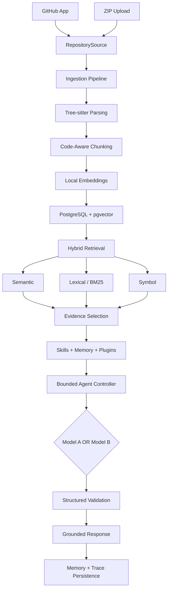

# Prism - Agentic RAG for Codebase Intelligence

Prism indexes a software repository and answers questions with file and line evidence. It accepts a read-only GitHub App installation or a ZIP upload, parses Python, JavaScript, TypeScript, JSX, and TSX with Tree-sitter, stores local embeddings in PostgreSQL with pgvector, and combines semantic, lexical, and symbol retrieval. One bounded controller selects tools and invokes only the model slot chosen by the user. Prism reads and analyzes repositories; it does not edit them.

The tested full-stack pattern is FastAPI with React and Vite. The practical target is about 2,000 indexable files. Larger indexes receive a warning; ZIP, extracted-size, raw-file-count, and individual-file limits remain hard bounds. See [PRISM_SPEC.md](PRISM_SPEC.md) for the precise scope and [backend/ACCEPTANCE_CHECKLIST.md](backend/ACCEPTANCE_CHECKLIST.md) for what has been verified and what still needs a live demonstration.

## Architecture

The diagram mirrors section 5 of the specification. The actual lexical implementation uses PostgreSQL full-text search, not a separate BM25 service. GitHub supplies content during import and sync; ordinary questions use Prism's stored index. Both sources feed `backend/app/ingestion/`. Local embeddings are separate from Model A and Model B.

## Capabilities and code locations

| Capability | Current implementation |
| --- | --- |
| Codebase Q&A | `backend/app/agent/controller.py`, `backend/app/api/routes/analysis.py`, and the Ask tab in `frontend/src/components/workspace/AnalysisWorkspace.tsx` |
| Multi-file Flow Trace | `backend/app/agent/investigations/flow_trace.py` and `POST /repositories/{id}/flow-trace`; unproven transitions remain unresolved |
| Change Impact | `backend/app/agent/investigations/change_impact.py` and `POST /repositories/{id}/change-impact`; direct and likely indirect items are separate |
| Architecture Explanation | `backend/app/tools/repository_tools.py`, `backend/app/agent/architecture.py`, and `GET /repositories/{id}/architecture` |
| Model selection and explicit comparison | `backend/app/llm/`, `backend/app/agent/compare.py`, and the workspace model selector and Ask & Compare button; normal requests use one selected slot |
| Skills and tools | `backend/app/tools/registry.py` registers 11 real tools; `backend/app/tools/repository_tools.py` holds repository and memory tools |
| Memory | `backend/app/memory/service.py` stores session summaries, evidence-backed repository facts, and saved findings; the Memory and Findings workspace tabs display them |
| Hooks and trace | `backend/app/tracing/hooks.py` persists `AgentRun`, `ToolCall`, and `ModelExecution` data; the Agent Trace tab renders the recorded steps |
| File-reading plugin | `backend/app/plugins/file_reading/` reads bounded content from the current stored index |
| Conditional web-search plugin | `backend/app/plugins/web_search/` handles external-documentation questions through `/ask`; ordinary repository Q&A does not search the web |
| Grounding and validation | `backend/app/evidence/`, `backend/app/validation/`, and `backend/app/schemas/responses.py` build bounded context and validate schemas and citations |

## Local setup with Docker Compose

Prerequisites: Docker with Compose, Python 3.11 or newer for local scripts/tests, and Node.js 20 or newer for local frontend work. A configured Model A or Model B slot is needed for generated answers and the stack smoke test. Both slots are needed for Compare Models. The first local embedding load may require downloading the configured sentence-transformers model.

1. Copy `.env.example` to `.env` (PowerShell: `Copy-Item .env.example .env`). Replace `JWT_SECRET` with a strong local secret. Set `POSTGRES_DB`, `POSTGRES_USER`, `POSTGRES_PASSWORD`, and a matching `DATABASE_URL`. The Compose backend connects to host `postgres`; a backend run directly on the host needs its own reachable database URL. Do not commit `.env` or credentials.
2. Set `MODEL_A_NAME`, `MODEL_A_BASE_URL`, `MODEL_A_API_KEY` and/or the corresponding `MODEL_B_*` values for OpenAI-compatible `/chat/completions` endpoints. Set each slot's timeout as needed. The two slots are peers; Prism never falls back automatically.
3. Run `docker compose config --quiet`, then `docker compose up -d --build`. The backend entrypoint waits for PostgreSQL, runs `alembic upgrade head`, and starts Uvicorn. Open `http://localhost:5173`; backend health is `http://localhost:8000/health`.
4. Register in the UI, then use **Add Repository** to upload a ZIP or connect GitHub. Index status is shown after import. The demo source tree is `backend/tests/fixtures/demo_repo/`; package that directory's contents as a ZIP when importing it manually. `backend/tests/fixtures/demo-repo.zip` may also be used when present, but the tracked source tree is the canonical fixture.

For a static frontend instead of the Vite development server, run `docker compose -f docker-compose.yml -f docker-compose.prod.yml up -d --build`. The static frontend listens on port 5173 and proxies `/api` to the backend.

### GitHub App setup

Create a GitHub App with read-only Contents and Metadata permissions and user authorization during installation. Point its callback to a publicly reachable backend URL ending in `/github/callback`; set `GITHUB_APP_ID`, `GITHUB_CLIENT_ID`, `GITHUB_CLIENT_SECRET`, and `GITHUB_APP_PRIVATE_KEY_PATH` in `.env`. Put the PEM key under `run/secrets/`, mounted read-only in Compose. Set `GITHUB_CALLBACK_SUCCESS_URL` to the frontend landing URL. Start Prism, sign in, choose **Connect GitHub**, authorize the fixture repository, select its branch in the picker, and import. The user-facing flow cannot be verified without a live GitHub App and reachable callback. Tokens and private keys remain server-side.

For external documentation search, set `SERPAPI_API_KEY` server-side. The web plugin runs only for an explicitly external/current-documentation question classified by the backend. A missing or failing provider is shown as a limitation. Do not place this key in frontend variables.

### Run components directly

From the repository root, start PostgreSQL with `docker compose up -d postgres`. The default Compose file does not publish port 5432, so add a local port mapping in a Compose override if running the backend on the host. Set a matching host-reachable `DATABASE_URL` for the backend process. From `backend/`, run `python -m pip install -r requirements.txt`, `alembic upgrade head`, and `uvicorn app.main:app --reload`. From `frontend/`, run `npm ci` and `npm run dev`. Vite proxies `/api` to `http://localhost:8000` by default; set `VITE_DEV_API_TARGET` when the backend is elsewhere.

## Verification and evaluation

- From `backend/`, run `pytest -p no:cacheprovider`. If local Windows temporary directories are inaccessible, pass the explicit `tests/test_*.py` files plus `tests/eval/test_evaluation_thresholds.py` and `tests/fixtures/demo_repo/backend/tests/test_api.py`, as described in [backend/SECURITY_REVIEW.md](backend/SECURITY_REVIEW.md).
- From `frontend/`, run `npm test` and `npm run build`.
- From `backend/`, run `python tests/eval/run_evaluation.py` and `pytest -p no:cacheprovider tests/eval/test_evaluation_thresholds.py`. The 26-question [evaluation report](backend/tests/eval/report.json) uses deterministic hash embeddings and MockProvider; it is not a live-model score. PostgreSQL/pgvector integration cases are opt-in via `PRISM_TEST_POSTGRES_URL`.
- From the repository root, run `python backend/scripts/smoke_test_stack.py` for the three-service development stack, or add `--production` for the static frontend variant. It builds the stack, creates a disposable account and ZIP repository, waits for READY, asks a grounded Q&A question through a configured real model, and checks the trace. It leaves those records for inspection.

The recorded deterministic evaluation reports 100% Hit@12, citation validity, ordered flow-step recall, and direct and indirect impact recall across 26 questions, with zero invalid references. The historical core-logic coverage measurement is 92.52% in [backend/tests/eval/COVERAGE.md](backend/tests/eval/COVERAGE.md). A runnable seven-beat live walkthrough is in [backend/DEMO_SCRIPT.md](backend/DEMO_SCRIPT.md).

## Current limits and acceptance status

The complete acceptance review is in [backend/ACCEPTANCE_CHECKLIST.md](backend/ACCEPTANCE_CHECKLIST.md). Supplementary-document tables and a user-facing GitHub installation disconnect are not implemented. The final recorded live demo and any environment-specific GitHub, provider, and PostgreSQL checks still require a person. The current GitHub sync endpoint runs synchronously while recording index stages, despite the specification's background-job plan.

Status: Phase 28 complete; Phase 29 acceptance review pending
